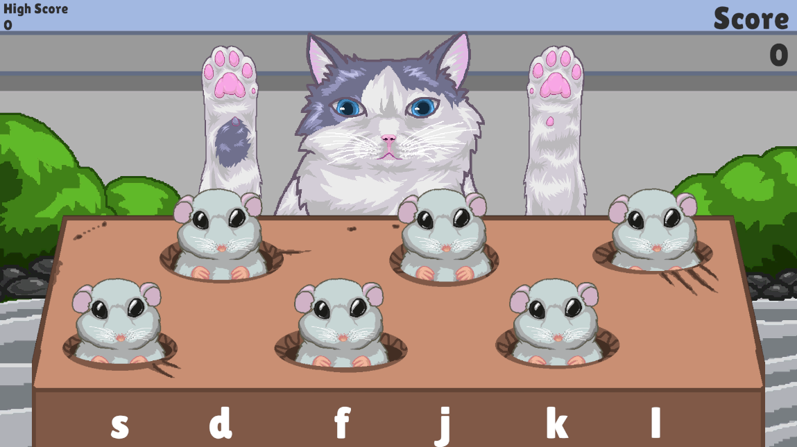

# Jasnah's Boppers

Created for the GMTK 2023 Game Jam, where this year's theme is "Roles Reversed" 
Place as the mice, and try to avoid Jasnah's Bops by pressing the key on your keyboard that corresponds to the mouse you want to have duck. Her paw will get a red outline when she is about to strike to give you a few moments of warning.

## Credits

### Programming
Gabriel Peterson

### Artwork
UsagiYokai 
[UsagiYokai's Twitch](https://www.twitch.tv/usagi_yokai)

## Music Used

### Fallen leaves by 陽菜/Hina
Music: https://www.chosic.com/free-music/all/ 

### The Army of Minotaur by Makai Symphony
The Army of Minotaur by Makai Symphony | https://soundcloud.com/makai-symphony 
Music promoted by https://www.chosic.com/free-music/all/ 
Creative Commons CC BY-SA 3.0 
https://creativecommons.org/licenses/by-sa/3.0/ 

## Sound FX Used

### whack01.mp3 by Qat
https://freesound.org/people/Qat/sounds/114682/